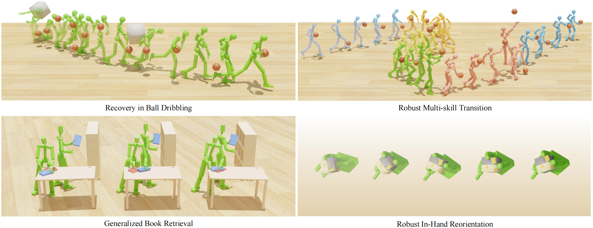

<div align="center">
<h2><font color="#3c9ff7"> SkillMimic-V2</font>: Learning Robust and Generalizable Interaction Skills from Sparse and Noisy Demonstrations</h2>

[Runyi Yu*](https://ingrid789.github.io/IngridYu/), [Yinhuai Wang*](https://wyhuai.github.io/info/), [Qihan Zhao*](https://scholar.google.com/citations?hl=en&user=36UHwBQAAAAJ), Hok Wai Tsui, [Jingbo Wang](https://scholar.google.com/citations?user=GStTsxAAAAAJ&hl=en&oi=ao), [Ping Tan](https://ece.hkust.edu.hk/pingtan) and [Qifeng Chen](https://cqf.io)


<strong>SIGGRAPH 2025</strong>

<a href='https://arxiv.org/abs/2505.02094'></a> <a href='https://ingrid789.github.io/SkillMimicV2/'></a>  [](https://github.com/Ingrid789/SkillMimic-V2,pko) <a href='https://youtu.be/jk94jXUsyhE'></a>
</div>

<!-- # SkillMimic-V2
[Paper](https://arxiv.org/abs/2505.02094) | [Project Page](https://ingrid789.github.io/SkillMimicV2/) | [Video](https://youtu.be/jk94jXUsyhE)

Official code release for the following paper:
"**SkillMimic-V2: Learning Robust and Generalizable Interaction Skills from Sparse and Noisy Demonstrations**" -->



Our framework enables physically simulated robots to learn robust and generalizable interaction skills from sparse demonstrations: (top left) Learning sustained and robust dribbling from a single, brief demonstration; (top right) acquiring robust skill transitions from fragment skill demonstrations; (bottom left) generalizing book grasping to varied poses from one demonstration; and (bottom right) learning to reorientate a cube from a single grasp pose.
# 📹 Demo
<div align="center">
  
</div>

# TODOs
- [ ] Release models on household manipulation task.

- [X] Release models on locomotion task.

- [X] Release models on ballplay task.

- [X] Release training and evaluation code.

# Installation 💽
Please following the Installation instructions of [SkillMimic](https://github.com/wyhuai/SkillMimic). After that you should run the following commands:
```
pip install six
pip install pytorch-lightning==1.9.0
```

# Pre-Trained Models
Pre-trained models are available at `models/`

# HOI Dataset
Run following command to view our HOI dataset by adding `--play_dataset`.
```
python skillmimic/run.py \
  --play_dataset \
  --task SkillMimic2BallPlay \
  --test \
  --num_envs 1 \
  --episode_length 1000 \
  --state_init 2 \
  --cfg_env skillmimic/data/cfg/skillmimic.yaml \
  --cfg_train skillmimic/data/cfg/train/rlg/skillmimic.yaml \
  --motion_file skillmimic/data/motions/BallPlay-Pick
```
- If your computer has more than 1 GPU, add `DRI_PRIME=1` before the above command, otherwise you may encounter display issues.
- You may specify `--motion_file`
- You can change `--state_init {frame_number}` to initialize from a specific reference state **(Default: random reference state initialization)**.

# BallPlay Skill Policy ⛹️‍♂️
The skill policy can be trained from sctrach, without the need for designing case-by-case skill rewards. Our method allows a single policy to learn a large variety of basketball skills from a dataset that contains diverse skills. 

## Inference
Run the following command:
```
python skillmimic/run.py \
  --test \
  --task SkillMimic2BallPlay \
  --num_envs 2 \
  --cfg_env skillmimic/data/cfg/skillmimic_test.yaml \
  --cfg_train skillmimic/data/cfg/train/rlg/skillmimic.yaml \
  --history_embedding_size 3 \
  --hist_length 60 \
  --hist_ckpt hist_encoder/BallPlay/hist_model.ckpt \
  --motion_file skillmimic/data/motions/BallPlay \
  --state_init 2 \
  --episode_length 600 \
  --checkpoint models/BallPlay/SkillMimic-V2/model.pth
```
- If `--switch_motion_file {A}` is added, the policy will switch from skill `A` to skill `B` specified by `--motion_file {B}`
- You may control the skill switching using your keyboard. By default, the key and skill correspondence are as follows:
`←: dribble left`, `↑: dribble forward`, `→: dribble right`, `W: shoot`, `E: layup`.
- To save the images, add `--save_images` to the command, and the images will be saved in `skillmimic/data/images/{timestamp}`.
- To transform the images into a video, run the following command, and the video can be found in `skillmimic/data/videos`.
```
python skillmimic/utils/make_video.py --image_path skillmimic/data/images/{timestamp} --fps 60
```

To evaluate the baseline model trained with SkillMimic1, run the following command:
```
python tasks/run.py --test --task SkillMimic1BallPlay \
--num_envs 2 \
--cfg_env skillmimic/data/cfg/skillmimic_test.yaml \
--cfg_train skillmimic/data/cfg/train/rlg/skillmimic.yaml \
--motion_file skillmimic/data/motions/BallPlay \
--state_init 2 \
--episode_length 600 \
--checkpoint models/BallPlay/SkillMimic/model.pth
```

## Training
### History Encoder
Before training the skill policy, you have to train the history encoder first.
```
python -m skillmimic.utils.state_prediction_ballplay --motion_dir skillmimic/data/motions/BallPlay
```

### Offline Preprocess for Stitched Trajectory Graph
```
python skillmimic/run.py \
  --test \
  --task OfflineStateSearch \
  --cfg_env skillmimic/data/cfg/skillmimic.yaml \
  --cfg_train skillmimic/data/cfg/train/rlg/skillmimic.yaml \
  --motion_file skillmimic/data/motions/BallPlay \
  --graph_save_path skillmimic/data/preprocess/ballplay.pkl \
  --headless
```
### Policy
After completing the above two steps, you can run the following command to train a ballplay skill policy:
```
python skillmimic/run.py \
  --task SkillMimic2BallPlay \
  --episode_length 60 \
  --cfg_env skillmimic/data/cfg/skillmimic.yaml \
  --cfg_train skillmimic/data/cfg/train/rlg/skillmimic.yaml \
  --motion_file skillmimic/data/motions/BallPlay \
  --reweight --reweight_alpha 1.0 \
  --state_init_random_prob 0.1 \
  --state_switch_prob 0.1 \
  --state_search_to_align_reward \
  --graph_file skillmimic/data/preprocess/ballplay.pkl \
  --enable_buffernode \
  --hist_length 60 \
  --history_embedding_size 3 \
  --hist_ckpt hist_encoder/BallPlay/hist_model.ckpt \
  --headless
```
- During the training, the latest checkpoint model.pth will be regularly saved to output/, along with a Tensorboard log.
- `--cfg_env` specifies the environment configurations, such as number of environments, dataFPS, ball properties, etc.
- `--cfg_train` specifies the training configurations, such as learning rate, maximum number of epochs, network settings, etc.
- `--motion_file` can be changed to train on different data, e.g., `--motion_file tasks/data/motions/BallPlay-Pick`.
- `--state_init_random_prob` specifies the state randomization probability.
- `--state_switch_prob` specifies the state transition probability.
- `--graph_file` specifies offline constructed state transition graph (STG) file.
- `--headless` is used to disable visualization.
- It is strongly encouraged to use large `--num_envs` when training on a large dataset. Meanwhile, `--minibatch_size` is recommended to be set as `8×num_envs`.
# Household Manipulation Policy 🤹


# Locomotion Skill Policy 🏃‍♂️
The commands for Locomotion are similar to those for BallPlay, with no additional considerations. Here are the examples:
## Inference
```
python skillmimic/run.py \
  --test \
  --task SkillMimic2BallPlay \
  --num_envs 2 \
  --cfg_env skillmimic/data/cfg/skillmimic_test.yaml \
  --cfg_train skillmimic/data/cfg/train/rlg/skillmimic.yaml \
  --history_embedding_size 3 \
  --hist_length 60 \
  --hist_ckpt hist_encoder/Locomotion/hist_model.ckpt \
  --motion_file skillmimic/data/motions/Locomotion \
  --state_init 2 \
  --episode_length 600 \
  --checkpoint models/Locomotion/model.pth
```
## Training
### History Encoder
```
python -m skillmimic.utils.state_prediction_ballplay --motion_dir skillmimic/data/motions/Locomotion
```

### Offline Preprocess for Stitched Trajectory Graph
```
python skillmimic/run.py \
  --test \
  --task OfflineStateSearch \
  --cfg_env skillmimic/data/cfg/skillmimic.yaml \
  --cfg_train skillmimic/data/cfg/train/rlg/skillmimic.yaml \
  --motion_file skillmimic/data/motions/Locomotion \
  --graph_save_path skillmimic/data/preprocess/locomotion.pkl \
  --headless
```
### Policy
After completing the above two steps, you can run the following command to train a ballplay skill policy:
```
python skillmimic/run.py \
  --task SkillMimic2BallPlay \
  --episode_length 60 \
  --cfg_env skillmimic/data/cfg/skillmimic.yaml \
  --cfg_train skillmimic/data/cfg/train/rlg/skillmimic.yaml \
  --motion_file skillmimic/data/motions/Locomotion \
  --reweight --reweight_alpha 1.0 \
  --state_init_random_prob 0.1 \
  --state_switch_prob 0.1 \
  --state_search_to_align_reward \
  --graph_file skillmimic/data/preprocess/locomotion.pkl \
  --enable_buffernode \
  --hist_length 60 \
  --history_embedding_size 3 \
  --hist_ckpt hist_encoder/Locomotion/hist_model.ckpt \
  --headless \
```
# BallPlay Match Policy ⛹️‍♂️
Run the following code to control a player with keyboard inputs. `←: dribble left`, `↑: dribble forward`, `→: dribble right`, `W: shoot`, `E: layup`
You can dribble to a target position and shoot
```
DISABLE_METRICS=1 python skillmimic/run.py \
  --test \
  --task HRLVirtual \
  --projtype Mouse \
  --num_envs 6 \
  --episode_length 600 \
  --cfg_env skillmimic/data/cfg/skillmimic_test.yaml \
  --cfg_train skillmimic/data/cfg/train/rlg/hrl_humanoid_virtual.yaml \
  --motion_file skillmimic/data/motions/BallPlay/rrun \
  --llc_checkpoint models/BallPlay/SkillMimic-V2/model.pth \
  --checkpoint models/Matchup/model.pth \
  --hist_length 60 \
  --history_embedding_size 3 \
  --hist_ckpt hist_encoder/BallPlay/hist_model.ckpt
```
# Our works on HOI Imitation Learning 👏
[PhysHOI](https://github.com/wyhuai/PhysHOI):Physics-Based Imitation of Dynamic Human-Object Interaction

[SkillMimic](https://github.com/wyhuai/SkillMimic): Learning Basketball Interaction Skills from Demonstrations

# References 🔗
If you find this repository useful for your research, please cite the following work.
```
@misc{yu2025skillmimicv2,
      title={SkillMimic-V2: Learning Robust and Generalizable Interaction Skills from Sparse and Noisy Demonstrations }, 
      author={Runyi Yu, Yinhuai Wang, Qihan Zhao, Hok Wai Tsui, Jingbo Wang, Ping Tan and Qifeng Chen},
      year={2025},
      eprint={2505.02094},
      archivePrefix={arXiv},
      primaryClass={cs.CV}
    }
```

# Acknowledgements 👏
The household manipulation dataset used in this work is derived from [Parahome](https://github.com/snuvclab/ParaHome). If you utilize the processed motion data from our work in your research, please ensure proper citation of the original ParaHome publication.
